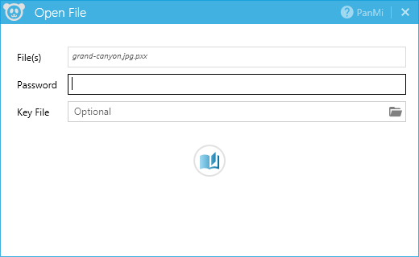
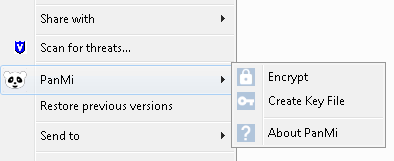
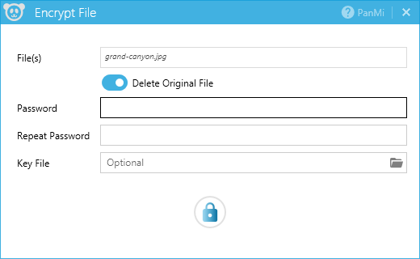
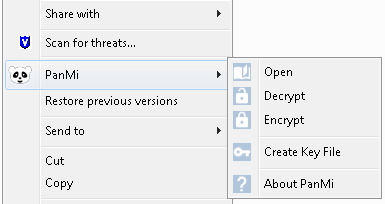
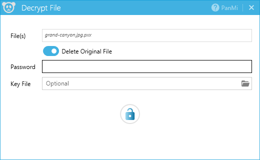
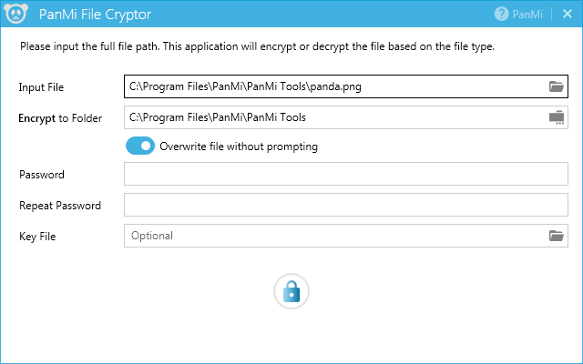

# PanMi
PanMi is a set of C#/.Net projects which use Encrypt-then-MAC (EtM) approach for file encryption. You can easily encrypt or decrypt files in a Windows context menu, or with a standalone application.

### Projects 
- ZXEncryption: Cryptography methods 
- ZXCryptApp: WPF application for file encryption/decryption
- ZXCryptShared: UI and file encryption/decryption functionalities
- ZXCryptShellExtension: Windows shell extension with context menus for file encryption/decryption
- ZXCryptMon: Monitor and clean up temp files
- ZXCryptInstall: Package installer project

### Usage
You can download and build projects with Visual Studion 15/17, or download the [latest](https://github.com/pangmi/PanMi/releases/latest) install package from the [release](https://github.com/pangmi/PanMi/releases). After install, you can run file encryption/decryption thru Windows conetext menu, or run the standalone application.

#### Open encrypted file
By default, the encrypted file has an extension of ".pxx". Double-click on a encrypted file will launch an Open dialog. Once a valid password provided, the original file will be opened.

#### Context Menu for file encryption

#### Context Menu for file decryption

#### Standalone Application

### Credit
The following open source projects are used:
- [SharpShell](https://github.com/dwmkerr/sharpshell)
- [MahApps.Metro](https://github.com/MahApps/MahApps.Metro)
